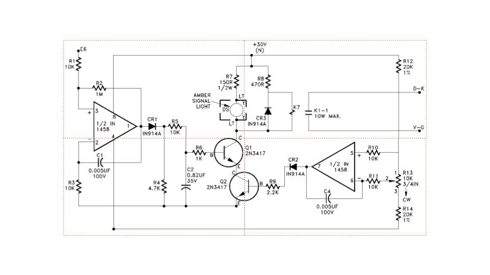
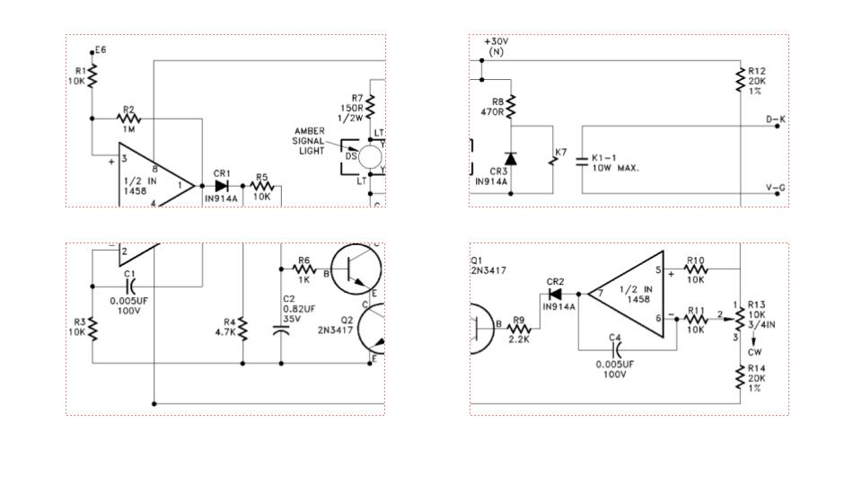
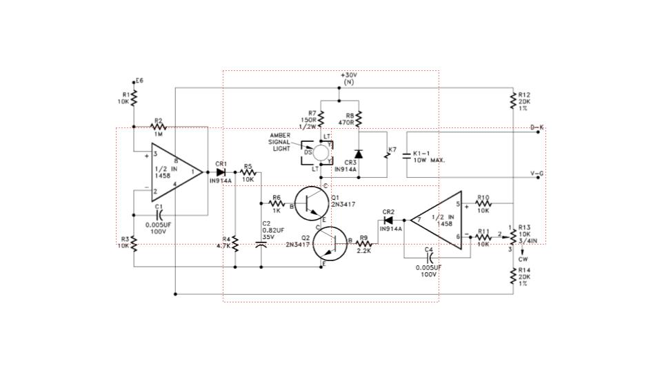
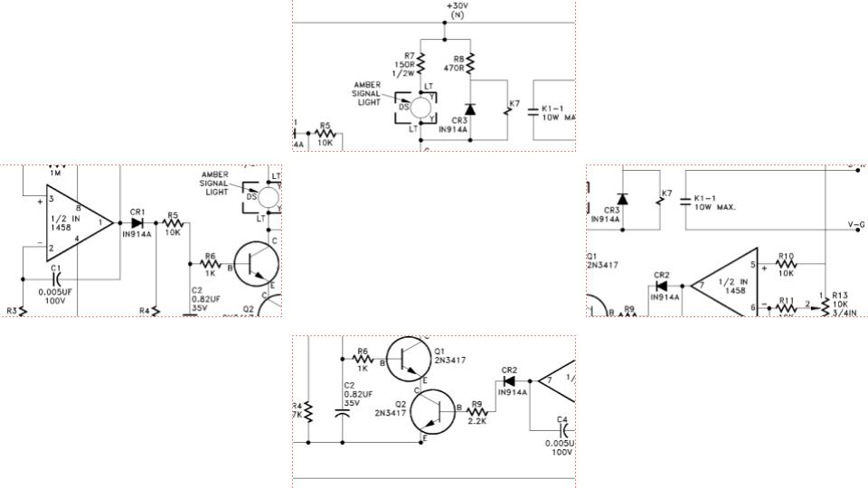

# img-segmenter

This tool is a POC designed to expand an object detection model resolution's range. For example, if a model is trained on 480px images, it will struggle on 1080px images. This tool will split that larger into smaller segments that the model can better handle.

`img-segmenter` will split the given image into eight different parts: each of the four corners, and four other images in the middle of the corners to eliminate overlap.






## Usage

Running `split_into_quarters` will output a dictionary of dictionaries. The `img` key contains an opencv-compliant image array. The `x1`, `y1`, `x2`, and `y2` keys are the xmin, ymin, xmax, and ymax of the img segment w.r.t the original image.

```python
return {
    "top_left": {"img": q1, "x1": 0, "y1": 0, "x2": half_w, "y2": half_h},
    "top_middle": {"img": top_middle, "x1": quarter_w, "y1": 0, "x2": quarter_w*3, "y2": half_h},
    "top_right": {"img": q2, "x1": half_w, "y1": 0, "x2": w, "y2": half_h},
    "bottom_right": {"img": q4, "x1": half_w, "y1": half_h, "x2": w, "y2": h},
    "bottom_middle": {"img": bottom_middle, "x1": quarter_w, "y1": half_h, "x2": quarter_w*3, "y2": h},
    "bottom_left": {"img": q3, "x1": 0, "y1": half_h, "x2": half_w, "y2": h},
    "center_left": {"img": center_left, "x1": 0, "y1":  quarter_h, "x2": half_w, "y2": quarter_h*3},
    "center_right": {"img": center_right, "x1": half_w, "y1":  quarter_h, "x2": w, "y2": quarter_h*3},
}
```

From this, you can run inference on each segment, and each bounding box received from inference can be normalized like so

```python
result["xmin"] += partition["xmin"]
result["ymin"] += partition["ymin"]
result["xmax"] += partition["xmin"]
result["ymax"] += partition["ymin"]
```

where `result` is a bounding box of a detected object and `partition` is one of the image segment dictionaries described above.